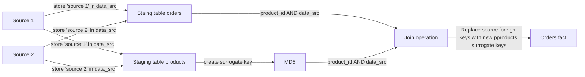

# OLAPify

**DISCLAIMER:** This project uses the Northwind dataset as the source data, which is a publicly available dataset.

## Project Objectives

This project aims to craft a modern data warehouse solution that:

- Tracks orders by product, category, and location.
- Tracks product price changes using Slowly Changing Dimension (SCD) type 2.

## Business Logic

- Customer names, product names, categories, and location data are consistent across all sources.
- It is planned to integrate more data sources in the future.

## Approach

    Adding addition column in all staing tables called data_src to store source's name
    Assuming that cutomer name, product name, cateorie, location data doesn't cause conflicts, it's used as Surrogate key to replace source's foreign keys. Surrogate key can combine one or more concatenated and catsted as text columns using MD5 hashing.
    Source's foreign key and data_src are used as composite key to replace source's foreign key with new surrogate key..
    If possible, the below logic can be used to generate surrogate keys instead of joining.

## Surrogate Keys Logic

| Surrogate Key   | Logic                                        |
|-----------------|----------------------------------------------|
| `category_sk`   | MD5 Hash of cleaned `category_name`          |
| `product_sk`    | MD5 Hash of cleaned `product_name`           |
| `supplier_sk`   | MD5 Hash of cleaned `supplier_name`          |
| `employee_sk`   | MD5 Hash of cleaned `employee_name`          |
| `data_sk`       | MD5 Hash of cleaned `date` (from `dim_date`) |
| `location_sk`   | MD5 Hash of cleaned `location_name`          |

Data Lineage

